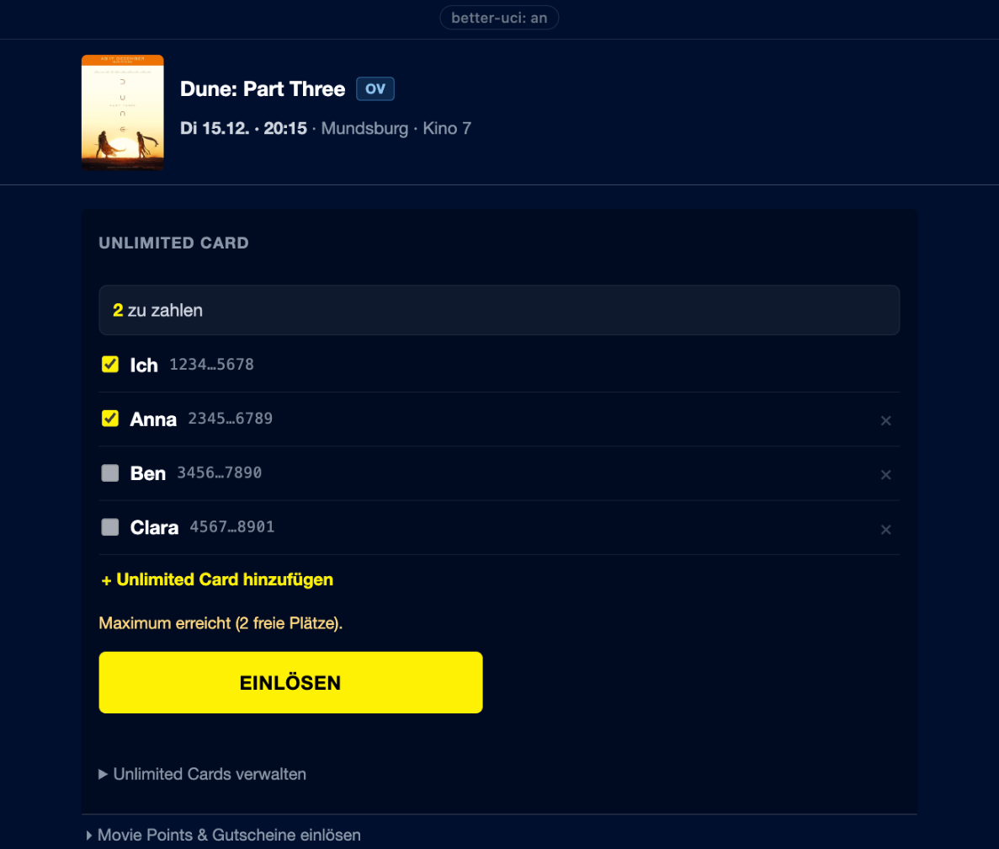
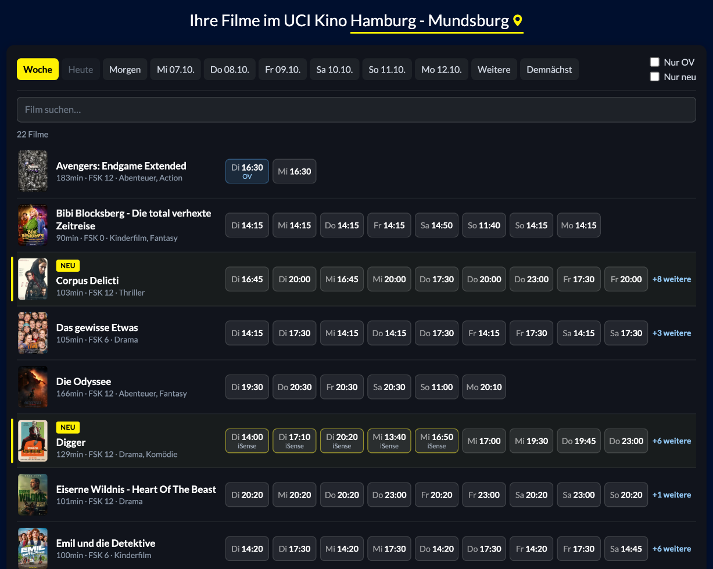
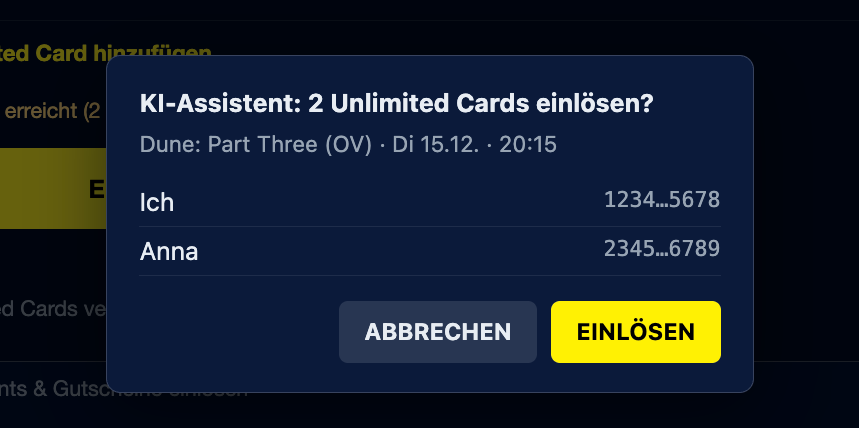

# better-uci
A [Tampermonkey](https://www.tampermonkey.net/) userscript for the UCI Kino
website:
- **Booking page** — redeem several Unlimited cards in one click instead of a
  multi-step dialog per card.
- **Programme page** — a denser, filterable schedule view instead of the
  native poster grid.
- **WebMCP** — both pages offer tools to AI agents in the browser, so an
  agent can find showtimes and redeem your cards (with your confirmation).
## Install
1. Install [Tampermonkey](https://www.tampermonkey.net/).
2. Chrome only: `chrome://extensions` → enable **Developer mode**, then enable
   **Allow user scripts** on Tampermonkey. Without this the script silently
   never runs.
3. **[Install better-uci](https://raw.githubusercontent.com/n-klocke/better-uci/main/better-uci.user.js)**
Updates install themselves.
## iPhone / iPad
Tampermonkey doesn't exist on iOS. Use
[Userscripts](https://apps.apple.com/app/userscripts/id1463298887) instead —
a free, open-source Safari extension that runs `.user.js` files directly, no
desktop needed.
1. Install **Userscripts** from the App Store.
2. **Settings** app → **Safari** → **Extensions** → **Userscripts** → turn it
   on → allow it for **All Websites** (or at least the `uci-kinowelt.de`
   domains).
3. In Safari, open
   [the raw script URL](https://raw.githubusercontent.com/n-klocke/better-uci/main/better-uci.user.js)
   — Userscripts should offer to install it. If it doesn't, open the
   Userscripts app itself and add it from that same URL.
4. Visit the booking or programme page, tap the puzzle-piece icon in
   Safari's address bar → **Userscripts**, and confirm better-uci is
   enabled for that site.
Updates show up in that same Userscripts popup (cloud icon), tap to
install. Saved cards don't sync from your desktop: bring them over with
**Unlimited Cards verwalten** → Exportieren / Importieren.
Only Safari works this way — Chrome, Firefox, etc. on iOS are all just
Safari's engine underneath and can't run extensions at all.
## Booking page: seat map
Replaces UCI's seat canvas with a clearer map. Seats keep their real
positions, categories are colour-coded with prices in the legend, and
wheelchair spaces, loveseats and taken seats are marked. Hover a seat for
its row, number and price. Selecting still runs through UCI's own seat
logic.
**★ Beste Plätze** picks the best free seats side by side for your ticket
count: at the aisle first, then central, then about a third of the way
in from the back wall. Hover it to see the pick first.

## Booking page: card redemption

Replaces the **Unlimited Card** section of the payment step with a list of
saved cards, live status, and automatic retry on UCI's intermittent errors.
Pick seats → continue to payment → **EINLÖSEN**. Your own card is read from
your login; add friends' cards once via **+ Unlimited Card hinzufügen**. It
pre-selects as many cards as there are open seats, picks the priciest seats
first, and skips cards already redeemed — including after a reload.
To see UCI's original page, click **better-uci: an** at the top of the
booking page — it switches every change off in place (and back on).

It doesn't make UCI faster — each call is still 5–10s server-side — it just
removes the clicking, the typing, and retrying failed attempts by hand. Seat
selection, checkout, payment, and the wallet pass stay manual. Card numbers
live only in browser storage and are sent nowhere except
`buchung.uci-kinowelt.de`; export them via **Unlimited Cards verwalten** and treat
that JSON like a credential.
## Programme page: schedule browser

Replaces the poster grid with a list view:
- **Date tabs** — today plus the next 7 days, one click away instead of a
  filter panel.
- **New this week** — films in their first week get a yellow **NEU**
  badge, films opening within the next 8 days a **Start** date badge.
- **Event** and **Sneak** badges for concerts/opera/live events and the
  Sneak Preview; **Preview**, **Midnight Movie** and **Women's Night**
  marked on the showtimes they apply to.
- **Nur OV** and **Nur neu** toggles, saved across visits.
- **Weitere** — everything beyond the 8-day window, grouped into *Nächste 30
  Tage* / *Später dieses Jahr* / *Nächstes Jahr und später* rather than one
  section per date. One row per film, with every one of its remaining dates
  as chips.
- **Demnächst** — real announcement data fetched from `/coming-soon` on
  first click: release date, and a **Buchen** button once it's actually
  bookable.
- A **search box** that filters whichever tab you're on, umlaut-insensitive.
## AI agents (WebMCP)

[WebMCP](https://webmachinelearning.github.io/webmcp/) is a proposed browser
API that lets a web page offer tools to an AI agent running in the browser.
better-uci registers tools on both UCI pages, so an agent can answer "OV
showings of Dune on Friday after 19:00?" from the real programme, and later
"redeem my card and Anna's" on the booking page, without scraping or clicking
through the site.

**Programme page** (`www.uci-kinowelt.de/kinoprogramm/…`):

| Tool | What it does |
|---|---|
| `search_showtimes` | Showings by title, date or date range, earliest/latest start time, original language only (OV, OmU, OmeU), format (IMAX, 3D, iSense…), new films only. Returns film details, each showing's auditorium, language, formats and Preview/Women's Night/Midnight marks, and its ids for `open_booking`. |
| `list_new_this_week` | Films with a NEU or Start badge, with their first showing. |
| `list_coming_soon` | Announced films with start date and whether they're bookable yet. |
| `open_booking` | Opens one showing's booking page. |

**Booking page** (`buchung.uci-kinowelt.de`):

| Tool | What it does |
|---|---|
| `get_booking_state` | Current step (seats, payment, confirm), film and showing, seats in the basket and what covers each one, amount still due. |
| `list_unlimited_cards` | Your own card ("Ich", from your login) and saved friends' cards by name, with masked numbers and whether each is already redeemed on this booking. |
| `redeem_unlimited_cards` | Redeems the named cards, yours and/or friends', on the payment step, at most one per open seat. |

What the agent can't do:
- **Redeem without you.** Every redemption opens the dialog above, with
  a seat map of your booked seats, and nothing happens until you click
  **Einlösen**. **Abbrechen** tells the agent
  you declined.
- **See card numbers.** Only masked numbers (`1234…5678`) ever leave the
  script. Cards are chosen by name.
- **Pick seats, check out or pay.** You pick seats on the seat map, and
  pressing Weiter and paying stay with you.

How to use it: you need a browser with WebMCP support (currently Chrome's
early preview, behind a flag) and an agent that reads WebMCP tools. The
tools register themselves on the programme and booking pages. In any other
browser, iPhone included, better-uci works exactly as before.

## Security & safety
- **Stays on UCI's domains.** Matches only `buchung.uci-kinowelt.de` and
  `www.uci-kinowelt.de`; the one extra fetch (`/coming-soon`) is
  same-origin. Nothing is sent anywhere else — no analytics, no third
  party, not even to me.
- **Minimal permissions.** Just `GM_setValue`/`GM_getValue` for local
  storage (or `GM.setValue`/`GM.getValue`, which is all Userscripts on
  iPhone offers) — no clipboard, no cross-origin requests.
- **No new login.** Reuses the page's own session; it never sees your UCI
  credentials.
- **Not obfuscated.** One plain-text file — open it in Tampermonkey and
  every line is what runs.
- **Cards stay local.** Stored on your machine only, never synced to me.
  Treat an exported backup like a credential.
- **WebMCP adds no network access.** The tools only exist inside the page and
  read what better-uci already reads. Any script on the page could call
  them, which is why they only return masked card numbers and why
  redeeming always waits for your click.
## Development
The booking flow calls several undocumented UCI endpoints — see
[`docs/API.md`](docs/API.md) for what's confirmed about each one (request
shapes, required headers, the `seatStr` field format) versus what's still
open. `fixtures/` has a real captured API response to check any parsing
logic against without needing a live session; run `node
test/validate-fixtures.js` to verify the current claims in `docs/API.md`
against it.

To try the WebMCP tools in a browser without WebMCP, install
[`test/webmcp-stub.user.js`](test/webmcp-stub.user.js) next to better-uci.
It provides a stand-in `document.modelContext`, and you can call any tool
from the page console:
`await __webmcp.call('search_showtimes', { query: 'dune' })`.
## Troubleshooting
No panel on either page? Filter the console for `[uci-batch]` (booking page)
or `[uci-browse]` (programme page) — both log what they find on load, so an
empty filter usually means the script isn't running (check install step 2)
rather than a bug in the page logic.
On iPhone there's no console: open **Unlimited Cards verwalten** in the
panel. Its last line shows whether the booking data and storage are
reachable, and internal errors are listed in the panel's log box.
## Disclaimer
Unofficial, not affiliated with UCI. Automates only what you're entitled to
do as a cardholder or visitor, which may still conflict with their terms.
Use at your own risk. Breaks whenever UCI changes their site.
MIT
